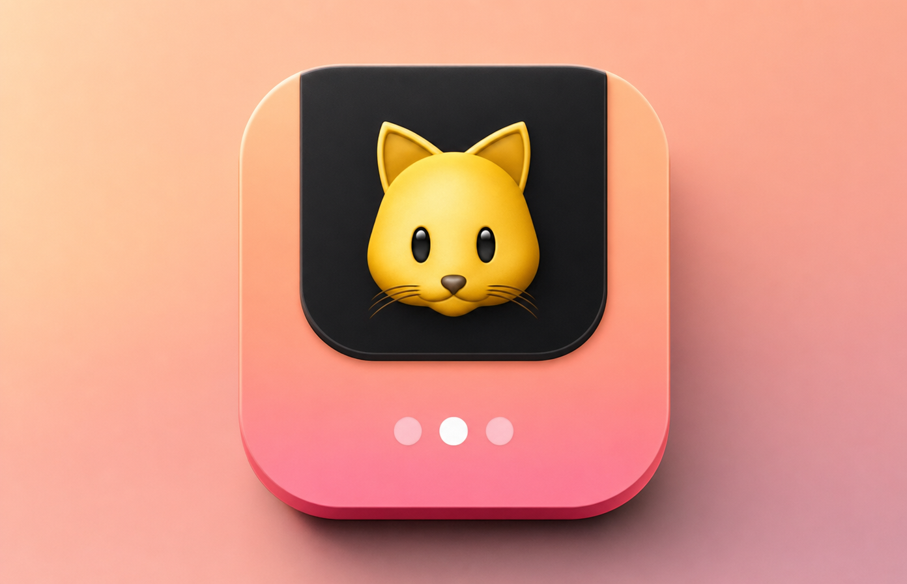

# NotchCute



Hover your MacBook's notch, pick a category of cute things, and the screen dims around a centered player that auto-plays posts from r/Eyebleach, r/aww, r/rarepuppers and friends.

## What it does

- **Notch hover:** rest the pointer in the notch for ~0.3 s and a black panel grows out of it with a card for Focus Boost, each category (Eye Bleach, Puppies, Kitties, Tiny Critters, Birbs, Otters & Pals) and your Favorites. Category cards show a live thumbnail from the latest feed.
- **Focus Boost:** a short run of baby animals (30 s, 1 min or 2 min) that ends on its own and hands you back to the app you were in. Press **⌃⌥C** anywhere to start one. This is the use the research supports: a quick look before careful work, not endless scrolling.
- **Spotlight:** click a category and everything dims except a centered window. Images stay up 8 s from the moment they appear, and the next one preloads. Videos play to the end; clips shorter than 8 s loop until they've had their time.
- **Controls:** ← → to skip, Space to pause, M for sound, F to favorite, O to open the post on Reddit, Esc / click outside / ✕ to close.
- **Favorites:** ♥ anything to keep it. Favorites get their own card and menu item.
- **Fresh first:** NotchCute remembers what you've watched and leads with posts you haven't seen.
- **Credit:** every post shows its author and links back to the Reddit thread.
- **Why it exists:** a line under the cards ("Research says a peek at baby animals sharpens your focus…") opens a window summarizing the research behind the app: Nittono et al. (2012, PLoS ONE), Myrick (2015), and Yoshikawa & Masaki (2021), with links to each paper.
- **Menu bar:** a 🐾 icon offers Focus Boost, the categories, Favorites, Focus Boost Length, Launch at Login, "Why cute things help…", and Quit.
- **Gentle filter:** skips posts whose titles mention NSFW or sad words ("RIP", "passed away"…). Not perfect.
- **Polite to Reddit:** uses public RSS feeds (no login), one combined request per category, and honors Reddit's rate-limit headers (unauthenticated feeds allow roughly one request a minute). Feeds are cached on disk and refreshed quietly in the background, so categories open instantly.
- **Light on battery:** the hover check wakes on mouse movement instead of polling, so NotchCute does nothing while you're not near the notch.

## Build

Requires macOS 14+ on Apple Silicon and the Xcode command-line tools.

```bash
bash build.sh
open build/NotchCute.app
```

`build.sh` draws the app icon from `Icon/make_icon.swift`, compiles `Sources/main.swift`, and ad-hoc signs the bundle. Copy `build/NotchCute.app` to `/Applications` to install (Launch at Login works best from there).

On Macs without a notch, a thin strip at the top-center of the screen acts as the trigger.

## Release

`release.sh` signs with your Developer ID and hardened runtime, notarizes, staples, and prints the zip's SHA-256. Store notary credentials once first:

```bash
xcrun notarytool store-credentials notchcute --apple-id YOUR_APPLE_ID --team-id YOUR_TEAM_ID
```

Then upload the zip to a GitHub release tagged `v<version>` and paste the SHA-256 into `packaging/notchcute.rb`, a Homebrew cask ready for a tap repo.

## License

MIT
